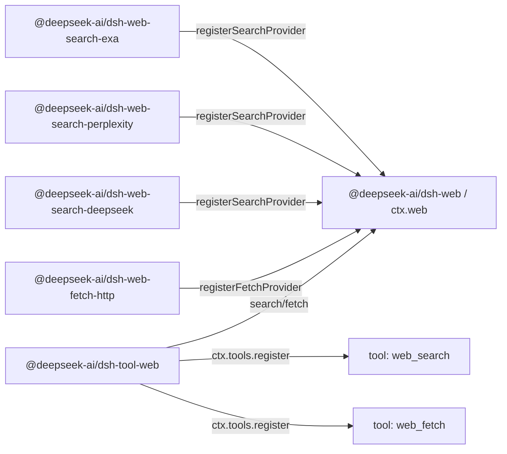

# Agent Note: Web 能力 seam——穩定的工具覆蓋多個提供方

Status: implemented

[English](2026-06-24-web-capability-seam.md) | 繁體中文

## 問題

harness 需要面向模型的 web 工具，但不能將模型約定綁定到某一家廠商的 API 形狀上。搜尋是當前的壓力點：從一開始就同時支持 Exa 搜尋和 Perplexity 搜尋——兩種刻意不同的提供方形狀（Exa 返回扁平的 `results[]`，每項包含 `{title, url, highlights, publishedDate}`；Perplexity 返回一段生成式回答加引用清單）——正是用來證明歸一化的 web 約定並非只是映像檔某一家廠商。Fetch 是另一項獨立操作：匿名公開 HTTP(S) fetch 後端涉及傳輸、安全、重定向、解碼和大小限制等關注點，與提供方支撐的搜尋並不相同。

面向模型的 API 必須保持穩定，而後端可以更換。更換搜尋提供方不應改變模型發起查詢的方式；更換 fetch 實作不應改變模型請求 URL 的方式。反過來，提供方包也不應僅僅因為自己有額外的提供方特有旋鈕就暴露自己的面向模型工具 schema。

如果把搜尋和 fetch 直接放進 `dsh-tool-web`，面向模型的工具就要同時承擔提供方選擇、後端請求對映、傳輸策略、結果歸一化、提示詞引導、展示和 schema 註冊。讓每個提供方註冊自己的工具則有相反的問題：工具的可用性、名稱、描述和參數將取決於恰好載入了哪些提供方包，提供方特有欄位會洩漏到模型約定中。

還有一個提供方選擇的問題。現有的 `tool-bash` 和 `tool-fs` 可以相依性 Cordis 的 `inject`，因為只有一個後端服務鍵。Web 有兩項獨立能力（`search` 和 `fetch`），每項能力可能有多個提供方。`inject: ['web']` 能證明 seam 存在，但不能證明存在可用的搜尋或 fetch 提供方，也無法定義多個提供方註冊時誰勝出。

## 決策

Web 訪問是一個一等能力 seam，遵循[能力 seam Agent Note](2026-06-13-capability-seams.md)：

1. `@deepseek-ai/dsh-web`（`packages/web/web`）擁有 `ctx.web`、提供方註冊、提供方選擇、共享的請求/結果詞彙，以及 web 特有的錯誤。
2. 提供方包實作具體後端並向 `ctx.web` 註冊能力，例如 `@deepseek-ai/dsh-web-search-exa`、`@deepseek-ai/dsh-web-search-perplexity`、`@deepseek-ai/dsh-web-search-deepseek` 和 `@deepseek-ai/dsh-web-fetch-http`。
3. `@deepseek-ai/dsh-tool-web`（`packages/web/tool-web`）擁有面向模型的 `web_search` 和 `web_fetch` 工具 schema、提示詞段落、參數校驗、結果格式化，以及透過 `ctx.web` 實作的工具展示。

提供方不註冊工具。提供方註冊能力。`dsh-tool-web` 是面向模型的名稱、描述、提示詞引導、JSON Schema、展示的唯一所有者。

搜尋和 fetch 是兩個獨立工具，但屬於同一個 web 訪問 seam。`ctx.web` 為兩個平行登錄檔統一擁有提供方選擇、abort/錯誤詞彙和部署設定。它們的請求 schema 和提供方邏輯保持獨立；共享的服務是觸達 web 的產品邊界。

`dsh-tool-web` 在產品啟用了相應工具且 `ctx.web` seam 存在時註冊面向模型的 web 工具。後端可用性是執行時關注點，而非 schema 註冊時關注點：

- `web_search` 在產品/應用啟用了 web 搜尋時註冊，`web_fetch` 在啟用了 web fetch 時註冊。
- 工具絕不會僅僅因為其選定的提供方缺失、設定錯誤、缺少憑證、存在歧義或暫時不可用就被註銷。
- 提供方在執行時解析，當選定的能力無法執行時期返回結構化的 `WebError`。

這使模型 schema 保持穩定，而不將外掛程式載入順序、憑證狀態或 HMR（熱模組替換）時序納入面向模型的約定。如果 web 搜尋已啟用但不存在可用的搜尋提供方，`web_search` 仍然可見，執行時以結構化的 `WebError`（如 `WEB_PROVIDER_UNAVAILABLE` 或 `WEB_PROVIDER_CONFIGURED_UNAVAILABLE`）失敗。如果某個提供方在 `dsh-tool-web` 之後出現，下一次執行即可使用它而無需更改 schema。如果某個提供方在呼叫過程中消失，執行以結構化的 `WebError` 失敗，而不是靜默選擇另一個提供方或回退到 `UNKNOWN_TOOL`。

該 seam 刻意不暴露任何觀察面——沒有登錄檔變更事件，也沒有聚合的能力狀態查詢。不可用性是呼叫方透過執行觀察到的事實：`search()`/`fetch()` 在呼叫時解析提供方，並拋出命名了失敗原因的結構化 `WebError`。[觀察面 Agent Note](../../archived/simplification/2026-07-04-drop-unconsumed-web-observation-surface.md) 記錄了這一判斷：基於呼叫的派生選擇與基於啟用的註冊使得沒有消費端需要變更訊號或獨立於執行和錯誤路由的可用性探測；未來的提供方狀態面板會重新引入它實際消費的最小訊號或查詢。

## 包拓撲

由三個包構成的 Service Definition / Service Provider / Consumer 拆分沿用 bash 和 filesystem 的模式，但*介面*包更接近 LLM（大型語言模型） seam。`LlmRuntime`（`packages/llm/llm/src/index.ts`）是一個按名稱鍵控的提供方登錄檔：`registerAdapter(models, adapter)` 將配接器存入 `Map`、返回 disposer、對重複鍵拋出 `DUPLICATE_ADAPTER`、在解析時拋出 `NO_ADAPTER`。`ctx.web` 沿用該登錄檔形狀，但有兩種能力類別和更豐富的選擇策略（設定的提供方 id，或在恰好只有一個可用提供方註冊時自動選擇），因此執行時拋出的 `WebError` 能解釋搜尋或 fetch 能力為何無法執行。

相依性方向與 bash 和 filesystem 一致：

```text
@deepseek-ai/dsh-tool-web  --depends on-->  @deepseek-ai/dsh-web  <--depends on--  @deepseek-ai/dsh-web-search-exa
        consumer                                 interface                       implementation
                                                                 <--depends on--  @deepseek-ai/dsh-web-search-perplexity
                                                                                  implementation
                                                                 <--depends on--  @deepseek-ai/dsh-web-search-deepseek
                                                                                  implementation
                                                                 <--depends on--  @deepseek-ai/dsh-web-fetch-http
                                                                                  implementation
```

執行時期，提供方包向 `ctx.web` 註冊能力；`tool-web` 向 `ctx.tools` 註冊穩定的工具並透過 seam 執行：



`@deepseek-ai/dsh-web` 僅相依性 Cordis 和底層 harness 支持。它聲明 `ctx.web`、提供方介面、請求/結果類型、提供方可用性約定和錯誤碼。它不匯入工具、agent（代理）、工作階段、LLM 或提供方包。

提供方包僅相依性 `dsh-web` 和 Cordis。它們擁有憑證、端點、協定格式對映、解析和 `WebError` 轉換，使用平臺 `fetch`。每個提供方注入共享服務並註冊後端；只有 `dsh-web` 擁有 `ctx.web` 鍵。提供方私有的協議形狀不會產生對 `ctx.llm` 或 Cordis HTTP 服務的相依性。

`@deepseek-ai/dsh-tool-web` 相依性 `@deepseek-ai/dsh-web`、`@deepseek-ai/dsh-tools`、`@deepseek-ai/dsh-system-prompt` 和 Cordis。它從不匯入具體的提供方包。

## `ctx.web` 約定

`ctx.web` 是一個提供方登錄檔加上一個帶提供方選擇的執行 API。登錄檔部分與 `LlmRuntime` 保持接近：每種能力類別一個 `Map<id, provider>`，`registerSearchProvider`/`registerFetchProvider` 方法返回 disposer，重複 id 拋出 `WebError`，執行時解析在選定提供方缺失或不可用時拋出例外。權威簽名見 `packages/web/web/src/types.ts`；seam 的形狀：

```ts
import type { WebFetchRequest, WebFetchResult, WebSearchRequest, WebSearchResult } from '@deepseek-ai/dsh-web'

interface WebSearchProvider {
  readonly id: string
  available(): boolean
  search(request: WebSearchRequest, signal?: AbortSignal): Promise<WebSearchResult>
}

interface WebFetchProvider {
  readonly id: string
  available(): boolean
  fetch(request: WebFetchRequest, signal?: AbortSignal): Promise<WebFetchResult>
}

interface WebRuntime {
  registerSearchProvider(provider: WebSearchProvider): () => void
  registerFetchProvider(provider: WebFetchProvider): () => void

  search(request: WebSearchRequest, signal?: AbortSignal): Promise<WebSearchResult>
  fetch(request: WebFetchRequest, signal?: AbortSignal): Promise<WebFetchResult>
}
```

選填的 signal 是執行控制，而非業務輸入：`tool-web` 直接傳遞 `exec.signal`，使輪次取消、工具逾時和 agent dispose（資源釋放）能到達提供方的網路請求、流讀取器和高開銷解碼。seam 不傳遞 `ToolExecution`——否則 `dsh-web` 就要相依性 `dsh-tools`。

提供方 id 是穩定字串，在各自的能力類別內唯一。註冊重複的搜尋提供方 id 或重複的 fetch 提供方 id 會失敗，而非靜默替換舊提供方。提供方註冊返回 disposer，沿用現有的 `ctx.tools.register()`/`ctx.systemPrompt.section()` 模式：變更包裹在 `ctx.effect()` 中，註冊隨貢獻它的 fiber 一起拆除。

## 提供方可用性與選擇

提供方可用性與能力選擇是兩個獨立概念，但都保持最小化。提供方僅報告該具體實作是否可用，透過廉價的本機檢查（如憑證是否存在、端點設定是否可解析）。提供方的 `available()` 禁止發起網路呼叫。

`LlmRuntime` 完全沒有狀態類型：可用性透過登錄檔成員資格加解析時拋出來表達。`ctx.web` 遵循同樣的紀律。seam 不暴露聚合的能力狀態查詢——`search()`/`fetch()` 在每次呼叫時根據設定的提供方 id、已註冊的提供方和每個提供方廉價的本機 `available()` 布林值派生選擇結果，選擇失敗就是執行時拋出的結構化 `WebError`。需要知道某項能力能否執行的呼叫方透過執行並路由該錯誤來獲知；沒有任何東西作為可變服務狀態儲存。

該布林值是選擇的輸入，而非健康系統。`tool-web` 從不直接呼叫提供方的 `available()`——它進入 seam 的唯一路徑是 `search()`/`fetch()`——因此選擇策略只有一個所有者。

選擇不得相依性註冊順序。Cordis 載入順序、設定排列和 HMR 時序不是產品語義。

| 情況 | 執行行為 |
|---|---|
| 設定的提供方 id 已註冊且 `available() === true` | 執行該提供方 |
| 設定的提供方 id 未註冊 | 以 `WEB_PROVIDER_CONFIGURED_MISSING` 失敗 |
| 設定的提供方 id 已註冊但不可用 | 以 `WEB_PROVIDER_CONFIGURED_UNAVAILABLE` 失敗 |
| 未設定提供方 id，且該類別恰好有一個已註冊且可用的提供方 | 執行該唯一提供方 |
| 未設定提供方 id，且該類別無已註冊提供方 | 以 `WEB_PROVIDER_UNAVAILABLE` 失敗 |
| 未設定提供方 id，且該類別有多個可用提供方已註冊 | 以 `WEB_PROVIDER_AMBIGUOUS` 失敗，而非按註冊順序選擇 |
| 未設定提供方 id，且有提供方存在但均不可用 | 以 `WEB_PROVIDER_UNAVAILABLE` 失敗 |

「唯一提供方自動選擇」規則面向測試、演示和簡單部署。產品設定設定顯式提供方 id：

```yaml
- id: web
  name: '@deepseek-ai/dsh-web'
  config:
    searchProvider: exa
    fetchProvider: http

- id: web-search-exa
  name: '@deepseek-ai/dsh-web-search-exa'

- id: web-search-perplexity
  name: '@deepseek-ai/dsh-web-search-perplexity'

- id: web-search-deepseek
  name: '@deepseek-ai/dsh-web-search-deepseek'

- id: web-fetch-http
  name: '@deepseek-ai/dsh-web-fetch-http'

- id: tool-web
  name: '@deepseek-ai/dsh-tool-web'
```

運維覆蓋走同一條顯式選擇路徑：`DSH_WEB_SEARCH_PROVIDER=perplexity` 等同於設定 `searchProvider: perplexity`，而非 `dsh-tool-web` 內部的隱式優先級鏈。

`ctx.web.search()` 和 `ctx.web.fetch()` 在執行時按上述選擇規則解析提供方。如果選定的能力不可用，它們拋出帶有結構化程式碼的 `WebError`，如 `WEB_PROVIDER_UNAVAILABLE`、`WEB_PROVIDER_CONFIGURED_MISSING`、`WEB_PROVIDER_CONFIGURED_UNAVAILABLE` 或 `WEB_PROVIDER_AMBIGUOUS`。如果未顯式設定提供方且不存在可用提供方，執行錯誤是通用的 `WEB_PROVIDER_UNAVAILABLE` 情況；刻意不提供對每個不可用提供方的診斷彙總。

## 搜尋請求與結果 schema

面向模型的 `web_search` 工具很小。唯一的面向模型參數是：

- `query`：必填字串。

`max_results` 不暴露給模型。它是 `dsh-tool-web` 層的決策：工具設定結果上限——`searchMaxResults` 外掛程式設定，默認 `8`（與 OpenCode 的 Exa 預設值對齊），類似 `dsh-tool-fs` 的 `readLimit`——並作為 `WebSearchRequest` 上的 `maxResults` 傳給 seam。將其排除在模型 schema 之外意味著模型只需提問，產品控制返回多少上下文；該欄位日後可以提升為面向模型的參數而不破壞 seam。

`maxResults` 沿工具 → seam → 提供方流動，上限在返迴路徑上強制執行：

- `dsh-tool-web` 擁有該值並將其放在 `WebSearchRequest.maxResults` 上。
- `ctx.web` 將請求原樣傳遞給選定的提供方。
- 當提供方的 API 支持結果數量控制時（Exa 的 `numResults`），提供方在請求層應用 `maxResults`，作為成本/延遲最佳化。
- `ctx.web` 在結果上強制執行上限：如果提供方返回的 source 數量超過 `maxResults`——因為其 API 沒有結果數量控制（Perplexity）或忽略了提示——seam 將 `sources[]` 截斷到 `maxResults` 並在返回前將 `WebSearchResult.truncated` 設為 `true`。這使上限成為面向模型層可以相依性的單一跨提供方保證，而非每個提供方都必須記得遵守的東西。

seam 請求不攜帶提供方特有的控制——沒有 Perplexity 模型選擇、搜尋時效性、網域過濾器、Exa `livecrawl`、Exa `type`、區域提示、生成式回答預算或搜尋深度。只有當某個欄位具有提供方無關的語義，且工具 schema 和選定的提供方都能誠實地遵守時，才會新增。

```ts
interface WebSearchRequest {
  readonly query: string
  /** Upper bound on returned sources; the seam truncates to it. Omitted = no bound. `dsh-tool-web` always sets it. */
  readonly maxResults?: number
}

interface WebSearchResult {
  readonly content?: string
  readonly sources: readonly WebSearchSource[]
  readonly truncated: boolean
}

interface WebSearchSource {
  readonly url: string
  readonly title?: string
  readonly snippet?: string
  readonly publishedAt?: string
}
```

`content` 是選填的提供方生成的回答文字、搜尋上下文或摘要。`sources[]` 是可移植的引用結構。source 必有 URL；title、snippet 和 `publishedAt` 選填，因為並非每個提供方都返回它們。`title` 不是必填：Perplexity 風格的引用可能只提供 URL，強制配接器編造標題會讓 seam 說謊。`dsh-tool-web` 渲染 `title ?? hostname(url)` 風格的回退標籤用於展示。`publishedAt` 是選填的發布/抓取時間戳，為 ISO-8601 字串——Exa 在每條結果上以 `publishedDate` 返回它，Perplexity 在搜尋結果上返回 `date`，因此它是真實的提供方資料而非派生值；seam 以字串形式傳遞，日期解析留給消費端。

Exa 搜尋將提供方扁平 `results[]` 的每一項對映為 `WebSearchSource`：`url` ← `url`、`title` ← `title`、`snippet` ← 第一個 `highlights[]` 條目（沒有 highlight 的條目沒有可移植的 snippet，被丟棄）、`publishedAt` ← `publishedDate`。Exa 不返回提供方生成的回答，因此 `content` 省略。Perplexity 搜尋將 `choices[0].message.content` 對映為 `content`，並優先使用結構化的頂層 `search_results[]` 作為 `sources[]`——`url` ← `url`、`title` ← `title`、`snippet` ← `snippet`（常為空）、`publishedAt` ← `date`——僅在 `search_results` 缺失時回退到純 URL 的 `citations[]` 陣列（這些 source 只有 `url`）。如果提供方返回的結構化欄位少於 seam 支持的，配接器省略那些選填欄位。

完整頁面取得仍是 `web_fetch(url)` 的職責。搜尋 snippet 是發現上下文，不是取得到的頁面正文。

## Fetch 請求與結果 schema

`web_fetch` 的實作是一個匿名公開 HTTP(S) fetch 提供方 `http`。它從具體 URL 取得位元組，應用下述基本傳輸衛生措施（僅 http/https、拒絕 URL 中的憑證、位元組/時間上限、跨源重定向阻斷），解碼文字內容，並僅返回最小的模型可用結果：最終 URL、狀態碼、正文和截斷標志。它不攜帶瀏覽器 cookie、編輯器憑證、git 憑證、內部認證權杖，也不隱式訪問私有服務。（完整的 SSRF/私有網路阻斷推遲——見[推遲工作](#deferred-work)。）

seam 請求比 OpenCode 的面向模型工具更小：

- `url`：必填 HTTP(S) URL。

seam 請求刻意不包含逐呼叫逾時、`format`、`prompt` 或提供方特有的提取控制。取消透過直接的選填執行訊號實作，fetch 提供方擁有一個部署設定的逾時兜底。`format` 是對已取得資源的展示決策；`prompt` 是更高層的 LLM 摘要指令；Firecrawl、Exa、Tavily 或 Parallel 等提取 API 可能不暴露具體的 HTTP 回應。如果產品日後需要提供方支撐的頁面提取，那是一個獨立的 `web_extract` 能力或對本 seam 的刻意擴充——提取語義絕不透過將每個 HTTP 欄位設為選填來偷渡進 `web_fetch`。

HTTP 狀態碼是已取得資源狀態的一部分，不自動構成工具失敗。透過網路成功取得到 `404` 或 `500` 回應時，會返回帶有狀態碼和有界解碼正文（當內容類型受支持時）的 `WebFetchResult`。`WebError` 用於無法安全取得或表示資源的失敗：無效或被阻斷的 URL、重定向策略違規、逾時、abort、回應過大、不支持的內容類型、提供方失敗或網路失敗。

```ts
export interface WebFetchRequest {
  readonly url: string
}

export interface WebFetchResult {
  readonly url: string
  readonly statusCode: number
  readonly body: WebFetchBody
  readonly truncated: boolean
}

export type WebFetchBody =
  | { readonly kind: 'html'; readonly content: string }
  | { readonly kind: 'text'; readonly content: string }
```

`WebFetchResult.url` 是允許的重定向之後的最終 URL。請求 URL 已在 `WebFetchRequest` 中，因此沒有單獨的 `requestedUrl`/`finalUrl` 對。

`WebFetchBody` 是封閉的可辨識聯合類型，因為正文類別需要 seam、提供方和工具三方協調變更，而非獨立的外掛程式擴充。窮舉 switch 使新類別在每個渲染器處編譯失敗，直到被處理。獨立的對象分支為類別特有欄位留出空間。

提供方負責安全的資源取得：URL 校驗、HTTP 傳輸、重定向策略、逾時、abort 傳播、位元組上限、字元集解碼、內容類型分類和二進位拒絕。`dsh-tool-web` 負責展示：HTML 轉 Markdown、HTML 轉純文字、面向模型的截斷格式化，以及未來的摘要。

fetch 提供方的資源控制：

- 僅接受 `http:` 和 `https:` URL；拒絕 URL 中的憑證。
- 強制執行最大 URL 長度、回應位元組上限、解碼正文字元上限、逾時和重定向跳數上限。
- Abort 訊號傳播到網路取得和高開銷解碼。
- 僅自動跟隨同源重定向；跨源重定向以 `WEB_REDIRECT_BLOCKED` 失敗，要求一次新的工具呼叫，從而觸發新的提供方/權限決策。（Claude Code 的 WebFetch 使用同樣的模型——它不自動跟隨跨主機重定向，而是將重定向目標返回給模型以發起新呼叫。）
- 請求攜帶顯式的產品 User-Agent，而非靜默偽裝瀏覽器。

SSRF/私有網路防護（阻斷私有、回環、鏈路本機、多播及其他非公開目的地，透過先 DNS 解析再驗證 IP 來防禦 rebinding，並在重定向的每一跳重新驗證）**推遲**——見[推遲工作](#deferred-work)。在其落地之前，`web_fetch` 是一個 SSRF 原語，不得在能觸達敏感內部網路目標的部署中啟用。

## 工具消費端行為

`dsh-tool-web` 擁有兩個 `ToolDefinition`：`web_search` 和 `web_fetch`。它擁有面向模型的 JSON Schema、snake_case 參數名、提示詞段落、結果渲染為 `ContentBlock[]`、`presentCall` 和 `presentResult`。

`dsh-tool-web` 禁止枚舉提供方或直接呼叫提供方的 `available()`。它進入 seam 的唯一路徑是 `ctx.web.search()`/`ctx.web.fetch()`。這將提供方選擇保持在單一層；否則工具包可能判定某個提供方可用，而執行時解析出不同的狀態。

工具註冊是最小化的穩定同步：外掛程式啟動時，`dsh-tool-web` 的 `Config`（`search?: boolean`、`fetch?: boolean`，均默認 `true`）啟用或停用每個 web 工具；已啟用的工具透過基於 effect 的登錄檔以 fiber 作用域的 disposer 註冊；任何工具都不會僅因其選定的提供方缺失、不可用或存在歧義而被 dispose；dispose `tool-web` fiber 時自動拆除其註冊。

提供方可用性變化影響執行結果和診斷資訊，而非面向模型的 schema 是否存在。如果產品完全不需要 web 工具，在設定中停用 `dsh-tool-web` 或單個 web 工具即可；如果需要 web 工具但後端設定有誤，模型在執行時看到結構化的工具錯誤。

提示詞引導解釋了語義分工——`web_search` 用於發現和取得當前資訊，`web_fetch` 用於模型需要特定 URL 內容的場景——提示詞和工具結果告訴模型用 Markdown 連結引用相關 URL。

面向模型的輸出以文字為先，因為工具結果是 `ContentBlock[]`，但 seam 的產出保持結構化，以便 UI 展示和未來的配接器無需解析渲染後的文字。

## 錯誤

`dsh-web` 定義 `WebError extends HarnessError`，帶有穩定的錯誤碼，僅覆蓋呼叫方可能合理分支的狀態：

- `WEB_PROVIDER_UNAVAILABLE`
- `WEB_PROVIDER_CONFIGURED_MISSING`
- `WEB_PROVIDER_CONFIGURED_UNAVAILABLE`
- `WEB_PROVIDER_AMBIGUOUS`
- `WEB_DUPLICATE_PROVIDER`
- `WEB_INVALID_URL`
- `WEB_BLOCKED_URL`
- `WEB_REDIRECT_BLOCKED`
- `WEB_FETCH_TOO_LARGE`
- `WEB_FETCH_TIMEOUT`
- `WEB_ABORTED`
- `WEB_UNSUPPORTED_CONTENT_TYPE`
- `WEB_PROVIDER_ERROR`

`WEB_DUPLICATE_PROVIDER` 在 `registerSearchProvider`/`registerFetchProvider` 發現該能力類別中已有相同 id 時同步拋出（類似 `LlmRuntime` 的 `DUPLICATE_ADAPTER`）；它是註冊時的程式設計錯誤而非執行結果，但共享 `WebError` 碼空間，使呼叫方看到統一的分類體系。`WEB_PROVIDER_ERROR` 是提供方自身失敗透過 seam 浮出的兜底碼，包括 `web-fetch-http` 中的網路/傳輸失敗（DNS、連線拒絕、TLS）；刻意不設單獨的 `WEB_NETWORK` 碼——提供方設定描述性訊息，使模型和日誌能區分網路失敗與提供方 API 失敗。

工具執行讓這些錯誤流經 `ToolRuntime.execute()`，後者已將 `HarnessError` 轉換為帶結構化元資料的錯誤工具結果。模型得到可讀的錯誤訊息；掛鉤、測試和 UI 程式碼可以根據穩定的錯誤碼路由。

## 測試

每一層在自己的邊界處固定：`dsh-web` 中的註冊/選擇/截斷/abort 約定與 `WebError` 碼；每個提供方基於錄制的 fixture（測試前置資料）的請求/回應對映（Perplexity fixture 包含純 URL 引用，以保持選填 source 欄位的誠實性），加上每個真實提供方的自跳過帶金鑰冒煙測試；`web-fetch-http` 中的真實本機 HTTP 行為；`dsh-tool-web` 中透過真實工具登錄檔的啟用驅動程式註冊、結構化執行錯誤和結果格式化。一個真實 Loader 冒煙測試守護兩種匯出形狀（[事後檢討（postmortem） 0001](../../../../docs/postmortem/0001-acp-default-export-drops-inject.md)）：`dsh-web` 是默認匯出的服務，而提供方和 `tool-web` 是命名空間外掛程式，誤加 `export default` 會丟失 `inject`。

## 曾考慮的替代方案

### 讓每個提供方註冊自己的面向模型工具

這與最靈活的提供方外掛程式系統一致：每個提供方可以暴露其完整的原生 schema。在 harness 中被否決，因為它將面向模型的名稱、描述、提示詞引導和結果格式化的所有權交給了提供方包。多個搜尋提供方會產生重複的工具名或提供方特有的工具名，模型將學到後端細節而非穩定的產品能力。

### 將提供方調度直接放在 `dsh-tool-web` 中

這類似 OpenCode 的本機 web 搜尋：一個穩定的 `websearch` 工具在內部調度到 Exa 或 Parallel。對於小型產品路徑可以接受，但作為 harness 基礎是錯誤的。工具包將擁有提供方選擇、憑證、請求對映、傳輸、回應解析和展示，使得在不將 Exa 和 Perplexity 的差異烘焙進工具 schema 的情況下難以新增它們。

### 將搜尋和 fetch 拆為兩個 seam（`dsh-search`、`dsh-fetch`）

很有吸引力，因為兩半不共享請求 schema 和業務邏輯，各自能幹淨地對映到 shell/fs 的三包範本上，且 `WebRuntime` 上的 `Search`/`Fetch` 方法對重複也會消失。否決，因為共享的機制——提供方 id 登錄檔、不相依性註冊順序的選擇策略、abort 傳播、`WebError` 分類體系，以及面向產品的「這個 harness 如何觸達 web」設定 API——是真實存在的，否則會在兩個幾乎相同的 seam 之間重複。一個 `ctx.web` 中間層給產品一個統一的注入和設定對象，給提供方選擇一個唯一的所有者。代價是平行的 `searchX`/`fetchX` 方法對，這是有意接受的。

### 選擇第一個註冊的提供方

否決。註冊順序不是產品策略。它可能隨設定順序、外掛程式載入、HMR 或重構而變化。提供方選擇必須是顯式的，或僅在恰好只有一個可用提供方時自動選擇。

### 將 Firecrawl/Exa/Tavily/Parallel 提取視為 fetch

在第一版中否決。這些提供方通常返回提取或摘要後的內容，而非具體的 HTTP 回應。如果產品需要提取，日後設計 `web_extract` 或刻意擴充 fetch 操作。

### 映像檔 Claude Code 的 `url + prompt` WebFetch 形狀

在 seam 層面否決。`prompt` 將 fetch 變成 LLM 摘要，並將公開 web 取得耦合到模型提供方。harness seam 應當確定性地取得和解碼；`dsh-tool-web` 日後可以將摘要作為展示模式提供，而無需讓 `ctx.web` 相依性 `ctx.llm`。

## 後果

**搜尋 schema 刻意精簡。** Exa 和 Perplexity 都暴露了有用的提供方特有控制；只有當某個控制能以提供方無關的方式定義、且工具註冊和提供方執行都能誠實遵守時，才會新增。

**Perplexity 引用可能稀疏。** 一條引用可能只有 URL。將 `title` 和 `snippet` 設為選填使 seam 保持誠實，但意味著 `tool-web` 需要渲染回退標籤。

**穩定的工具註冊將設定錯誤推遲到執行時。** 當產品啟用了 web 訪問時，保持工具可見是正確的；但期望 web 搜尋可用的產品應用應當明確暴露結構化的 `WEB_PROVIDER_CONFIGURED_MISSING`/`WEB_PROVIDER_CONFIGURED_UNAVAILABLE`/`WEB_PROVIDER_AMBIGUOUS` 失敗，避免使用者直到模型呼叫工具後才發現設定問題。

**提供方狀態可能在啟動後變化。** 一個工具可能在步驟開始時組裝的請求中可見，但在執行前失去其提供方。執行路徑重新解析並以結構化錯誤失敗。

**Fetch 是網路邊界，不僅僅是隻讀工具。** `web_fetch` 能觸達敏感網路目標或透過 URL 外洩資料。僅交付基本傳輸衛生措施（僅 http/https、拒絕憑證、位元組/時間上限、跨源重定向阻斷）；SSRF/私有網路阻斷推遲（見[推遲工作](#deferred-work)），因此在其落地之前，`web_fetch` 不得在能觸達內部目標的環境中啟用。

**大量 web 內容可能損害上下文質量。** 提供方強制執行位元組/字元上限並報告 `truncated`；`tool-web` 格式化有界的模型輸出，附帶清晰的繼續或後續引導。

<a id="deferred-work"></a>

## 推遲工作

- `web_fetch` 的 SSRF/私有網路防護：阻斷私有、回環、鏈路本機、多播及其他非公開目的地，使 `web_fetch` 不再是 SSRF 原語。正確實作不僅僅是 URL 字串檢查——需要先 DNS 解析再連線到已驗證的 IP（防禦 DNS rebinding/TOCTOU）、跨重定向的每跳重新驗證，以及 IPv6 邊緣處理（私有範圍、IPv4 對映地址）。所調研的參考實作均未做 IP 級阻斷（OpenCode 做前綴檢查後直接 fetch；Claude Code 相依性集中式主機名黑名單加「私有 URL 會失敗」的提示詞），因此沒有可複製的實作，且這是 harness 唯一的 SSRF 防線——值得一次專門的設計/spike。在其落地之前，`web_fetch` 只能在無法觸達敏感內部目標的部署中啟用。
- `pdf` `WebFetchBody` 類別：`http` 提供方將可文字提取的 PDF 解碼（盡力而為、有上限、`truncated`）為 `{ kind: 'pdf'; content; pageCount? }` 分支，`tool-web` 渲染它。這是 fetch 而非 `web_extract`——PDF 取得是具體的 HTTP 200 加確定性的本機解碼，不是提供方側對非 HTTP 資源的提取。新增它是跨 `dsh-web`（聲明分支）、提供方（解碼 + 將「二進位拒絕」收窄為「拒絕二進位，但可文字提取的 PDF 除外」；需要 OCR 的掃描/圖片 PDF 不在範圍內）和 `tool-web`（渲染）的協調變更。封閉的 `WebFetchBody` 聯合類型使消費端在新分支被處理之前編譯失敗。
- 提供方支撐的提取作為獨立的 `web_extract` 能力，而非靜默擴充 `web_fetch`。
- 權限策略整合：權限系統現已存在（[沙盒與審批](../feature/2026-07-06-sandbox.md)、[web 權限預設](../feature/2026-07-23-web-permission-and-approval.md)），但只捆綁了沙盒模式與審批策略；web 權限策略仍未整合。
- `query` 和 `maxResults` 之外的提供方無關搜尋控制，待 Exa 和 Perplexity 都能誠實遵守時再新增。

## 開放問題

- 產品應用包是否應在啟動時探測 web 設定（當 web 被顯式設定時將 `WEB_PROVIDER_CONFIGURED_MISSING`、`WEB_PROVIDER_CONFIGURED_UNAVAILABLE` 和 `WEB_PROVIDER_AMBIGUOUS` 視為致命錯誤），還是將設定錯誤留到首次執行時浮出？
- 在已交付的權限系統（[沙盒與審批](../feature/2026-07-06-sandbox.md)、[web 權限預設](../feature/2026-07-23-web-permission-and-approval.md)）中，公開 web 訪問的權限策略應放在哪裡：`tools/execute` 上的專用 web 權限外掛程式、提供方設定，還是兩者兼有？
