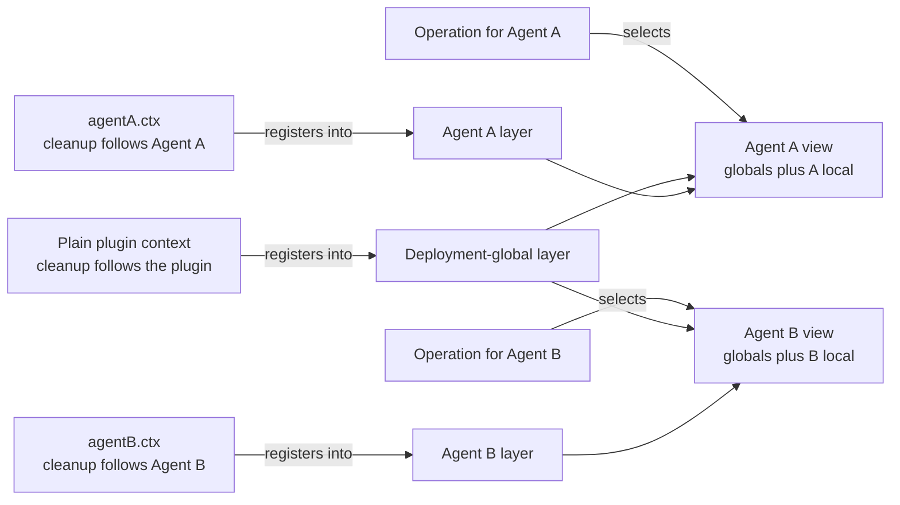
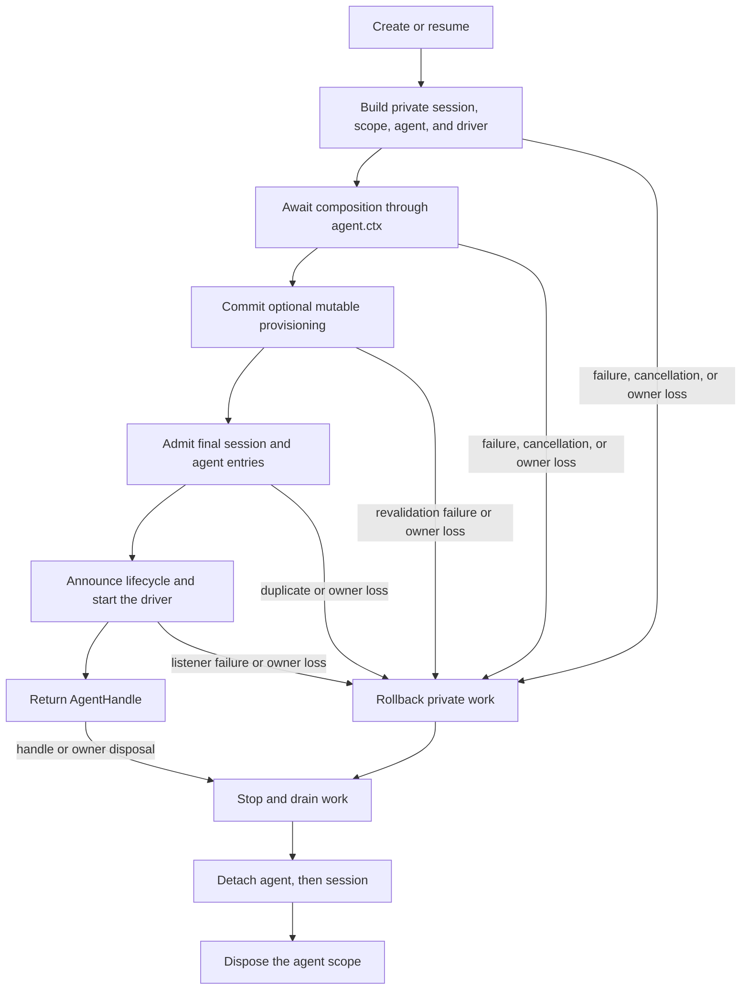

# Agent Note: agent 即註冊作用域

Status: implemented

[English](2026-07-08-agent-scope-contexts.md) | [简体中文](2026-07-08-agent-scope-contexts.zh.md) | 繁體中文

## 問題

一個應用需要在多個 agent（代理）之間共享基礎設施，同時讓每個 agent 擁有自己的工具、提示詞貢獻、策略和監聽器。共享的配接器、持久化和使用者介面屬於部署層面；而 persona、工具變體或監聽器往往只屬於某一個 agent。

為每個 agent 建立獨立的服務圖會重複共享基礎設施。使用一個全域性註冊圖則有相反的問題：某個 agent 特有的貢獻可能洩漏到無關的 agent 中。貢獻者需要一種普通的註冊機制，既能決定誰可以看到某項貢獻，又能決定何時清理它。

該機制還需要一個發布邊界。agent 在其本機世界建置完成之前不得變為可見，拆除時也必須保留該本機世界直到最終工作停止。

## 決策

每個存活的 agent 擁有一個扁平的註冊層，透過 `agent.ctx` 暴露。程式碼透過擁有某項貢獻的上下文進行註冊；具備作用域感知的服務將部署全域性註冊與恰好一個匹配的 agent 層合併；操作從其真實 agent 選擇該層；該層在 agent 的完整發布生命週期記憶體在。

Cordis 是 SDK 底層的外掛程式框架。Cordis **上下文**是外掛程式用來訪問服務和註冊效果的對象，效果的清理跟隨該上下文。[Cordis 入門](../../../../docs/cordis-primer.md)對該框架有更詳細的說明。

對大多數貢獻者而言，完整約定是四條規則：

| 問題 | 規則 |
|---|---|
| 在哪裡為某個 agent 註冊行為？ | 透過 `agent.ctx` 呼叫普通註冊 API |
| 某個 agent 的操作能看到什麼？ | 部署全域性加上該 agent 的層，按所屬服務的合併規則 |
| 哪些作用域監聽器會執行？ | 無作用域監聽器加上為該操作所屬 agent 註冊的監聽器 |
| 該層存在多久？ | setup 在發布前完成；dispose（資源釋放）保留該層直到工作完全靜止 |

作用域是扁平的。解析永遠不會遍歷父級或兄弟作用域，生命週期所有權也不意味著註冊繼承。



缺失的交叉邊即隔離規則：Agent A 的本機註冊不會進入 Agent B 的檢視表，父級的註冊也不會僅因父級擁有子級的生命週期就進入子級。

配套的[執行時期設計 Agent Note](2026-07-12-agent-scope-runtime-design.md) 闡述了實作與正確性推理。[subagent 組合控制 Agent Note](../feature/2026-07-12-subagent-persona-tool-filter-and-depth.md) 負責獨立的 `persona`、`toolFilter` 和 `maxDepth` 功能。

### 註冊來源決定可見性與清理

透過普通外掛程式上下文進行的註冊是部署全域性的，隨該外掛程式一起 dispose。同一方法透過 `agent.ctx` 呼叫則貢獻給一個 agent，隨該 agent 的作用域一起 dispose。

| 註冊來源 | 默認可見性 | 隨誰 dispose |
|---|---|---|
| 普通外掛程式上下文 | 每個符合條件的 agent 檢視表 | 註冊外掛程式 |
| `agent.ctx` | 僅該 agent 的檢視表 | agent 作用域 |

工具、提示詞段落與變數、工具限制、守衛以及作用域事件監聽器都遵循此約定。命名的本機值通常對該 agent 遮蔽同名全域性值；各所屬服務文件會說明例外與合併行為。

普通貢獻者的模式是在 agent setup 期間註冊完整的本機世界：

```js
const handle = await ctx.agents.create({
  sessionId: SessionId('reviewer'),
  agentOptions: { model: 'model-name' },
  setup(agentCtx) {
    agentCtx.systemPrompt.section({
      name: 'deployment:persona',
      order: 0,
      text: 'Review code, but do not modify files.',
    })
    agentCtx.tools.register({
      name: 'review_summary',
      description: 'Return the review summary.',
      parameters: { type: 'object', properties: {} },
      async execute() {
        return [{ type: 'text', text: 'review complete' }]
      },
    })
  },
})

ctx.tools.get('review_summary')                // undefined: not global
ctx.tools.get('review_summary', handle.agent)  // the reviewer-local tool

await handle.dispose()
ctx.tools.get('review_summary', handle.agent)  // undefined: scope is gone
```

setup 接收一個完整的受信 Cordis 上下文，因此可以組合普通外掛程式和服務。其約定僅限組合：不支持透過 cast 或內部登錄檔呼叫來驅動或發布正在建置中的 agent。

### 操作選擇檢視表

註冊來源與操作主體是兩個獨立的事實。透過 `agent.ctx` 呼叫服務決定的是新註冊歸屬何處，並不將後續讀取綁定到該 agent。

工具尋找與執行接收其所服務的 agent。提示詞組裝接收正在建置請求的 agent 的組裝上下文。事件分發接收其領域主體。這使共享服務實例可在多個 agent 間複用，同時讓每個操作的檢視表保持顯式。

只有採納了作用域約定的服務才會解析 agent 層。`agent.ctx` 不會自動改變任意 Cordis 服務呼叫的行為。

### 作用域事件將路由與事件資料分離

關於 Agent A 的事件通常到達無作用域監聽器和 A 作用域監聽器，而不到達 B 作用域監聽器。沒有 agent 主體的事件僅到達無作用域監聽器。

在 Cordis 層面，`Scoped<T>` 是一個不透明的路由接收器。它攜帶用於選擇監聽器的過濾器，但本身不是領域對象。因此事件簽名將真實的 `Agent`、工具執行、審批請求或其他主體作為顯式參數保留，供監聽器檢查。

以 `{ global: true }` 註冊的監聽器有意繞過上下文受眾過濾，但其清理仍跟隨註冊上下文。登錄檔成員變更通知保持不過濾，因為它們描述的是共享登錄檔狀態而非某個 agent 的操作。詳盡的事件參考是各[子系統頁面](../../../../docs/subsystems/core.md)上生成的 `cordis-surface` 區塊的集合——每個事件作用域在其所屬頁面上（`agent/*` 與 `agent-loop/*` 在 core.md 本頁）。

### 建立最後發布，dispose 最後撤銷

`ctx.agents.create()` 和 `resume()` 建置未發布的工作階段、作用域、agent 和驅動器。它們等待 `setup`，同步呼叫其選填的 `AgentSetupCommit`，准入最終的工作階段和 agent 條目，按序公告，啟動迴圈，然後才返回 handle。該提交操作讓可變的設定狀態在所有 setup 的 await 均結帳後，於確切的發布邊界重新校驗；若其拋出例外，則會在公告任何一個身份前回滾私有交易，而成功提交後的撤銷屬於普通的存活期拆除。

選填的建立訊號僅在建立或復原掛起期間取消工作。promise resolve 後，返回的 `AgentHandle` 擁有顯式 dispose 權。

如果載入、setup、選填的 setup 提交、准入或發布失敗，私有交易回滾其準備的一切。使用同一個呼叫方提供的存活 ID 的並行操作可能都到達 setup，但最終登錄檔條目只准入一個；每個失敗者拒絕並清理其私有資源。在等待 dispose 完成後的順序複用仍然有效。

`AgentHandle.dispose()` 反轉邊界。它停用建立或驅動，等待同步發布完成退棧，停止並排空驅動器和最終工作階段刷寫，分離 agent 和工作階段，最後 dispose 作用域。重複或競爭的 dispose 請求合併為一個完成 promise。

呼叫方的 Cordis 上下文和具體的 AgentLoop 工廠是結構性共同所有者。解除安裝任一方都會 dispose 交易或存活 agent。



## 安全與權限是非目標

agent 作用域組合的是受信的同進程註冊。它不沙盒化外掛程式、不定義父到子的權限格、不在建立時凍結授權、也不保證子級不能做超出父級的事。

父級可以擁有一個可見工具比自身更廣的子級，因為生命週期所有權不贈予也不限制註冊。持有 Cordis 上下文的外掛程式同樣執行在同一行程中，可以直接呼叫可用服務。

需要非升權保證的部署需要獨立的權限表示、傳播規則和執行檢查。父層子集授權、建立時授權快照、顯式未來授權 API，以及通用的能力/輸出/終止標籤均不在本決策範圍內。

## 曾考慮的替代方案

被否決的設計要麼將可見性與清理分離，要麼只覆蓋一類註冊，要麼重複共享基礎設施，要麼將生命週期所有權與繼承混為一談。

### 向每個註冊傳遞 agent 選項

類似 `tools.register(definition, { agent })` 的 API 在每個登錄檔中重複作用域傳遞邏輯，且允許可見性所有權與清理所有權漂移。透過 `agent.ctx` 註冊使兩個事實跟隨同一個 Cordis effect owner。

### 過濾事件但保持登錄檔全域性

監聽器過濾可以阻止錯誤的掛鉤執行，但無法限定工具 schema、可執行尋找、提示詞段落、變數或其他已註冊資料的作用域。agent 本機組合仍需臨時的全域性變更。

### 為每個 agent 建立獨立的服務圖

所需的檢視表是共享部署服務加上一個本機註冊層。每個 agent 一個服務圖會重複配接器，並使共享持久化、提供方登錄檔和應用啟動複雜化。

### 繼承父級註冊作用域

父子關係描述的是生命週期和對話譜系，而非通用合併策略。層級尋找會讓無關服務意外繼承，且在沒有獨立權限模型的情況下無法定義安全性。

## 後果

貢獻者使用一種熟悉的模式：透過外掛程式上下文註冊共享行為，透過 `agent.ctx` 註冊本機行為，在操作中選擇真實 agent，dispose 返回的 handle。從觀察者角度看，setup 及其選填的發布提交是原子的，拆除則保留本機行為直到工作停止。

代價是顯式的主體選擇、非同步的程式設計式建立，以及服務需要逐個採納作用域。扁平註冊作用域有意不等同於權限，subagent 組合控制作為獨立功能存在，而非隱藏的作用域語義。
