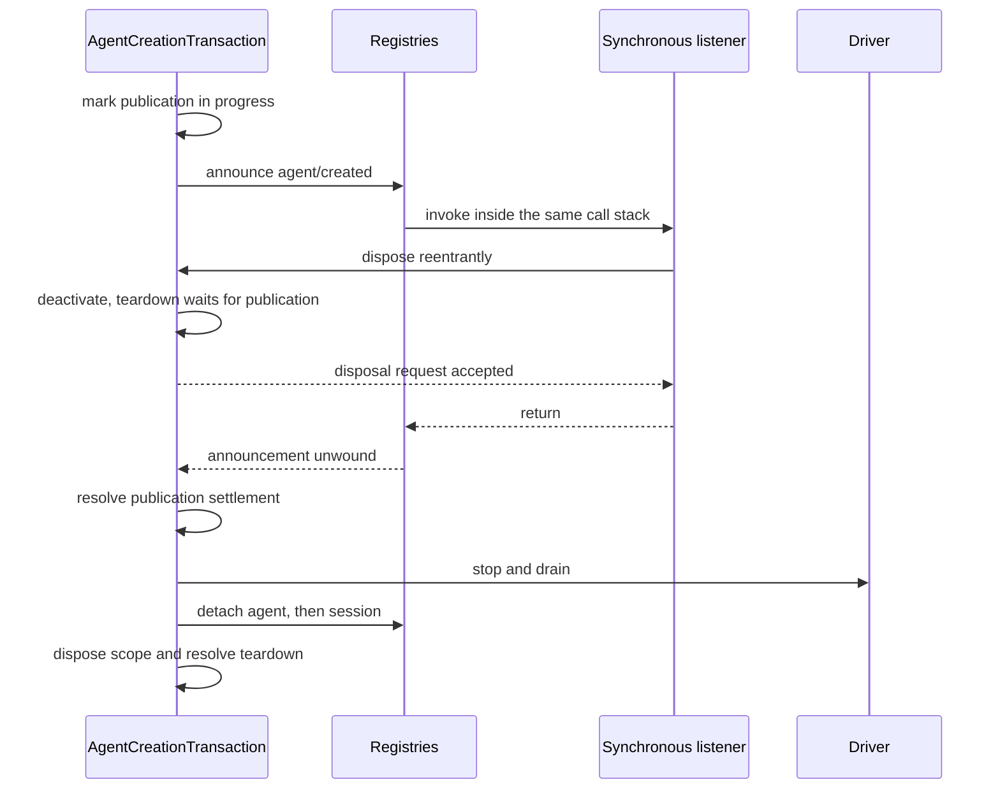

# Agent Note: Agent 作用域執行時期設計與正確性

Status: implemented

[English](2026-07-12-agent-scope-runtime-design.md) | 繁體中文

## 問題

[agent（代理）作用域約定](2026-07-08-agent-scope-contexts.md)對貢獻者而言很簡單：透過 `agent.ctx` 註冊，解析出一個全域性加單 agent 的檢視表，僅在 setup 完成後發布，並保持作用域直到工作停止。執行時期必須在協作式外掛程式框架、非同步建立、可重入監聽器、持久化工作階段提交以及 worker 或行程故障等場景下維護這份約定。

主要的設計風險是為每個競爭條件引入第二套機制。獨立的預留、就緒哨兵、取消中繼、快照層和保護登錄檔可能映像檔同一個事實，直到沒有讀者能分辨哪個纔是權威的。這些機制還會誘使執行時期把可信的類型化呼叫當作敵對的序列化邊界來處理。

實作需要足夠的狀態來維護真實的所有權和結帳邊界，但不能更多。正確性審查者必須能夠從接受、發布到拆除，沿著一條事實鏈跟蹤下去，而無需在平行的表示之間做調和。

## 決策

執行時期對每個獨立事實使用一種機制。作用域路由有一個不透明載體與共享 layer store；每個活躍的登錄檔對象有一條登錄檔條目；每個建立或復原操作有一個事務；類型化的同進程呼叫借用 readonly 值；真實資料邊界只物化一次；協作式提示詞組裝的結果即為權威；worker/行程程式碼僅在不同所有者確實可能競爭時才保留獨立的終止態和完全靜止態。

該設計可概括為七項選擇：

| 問題 | 權威機制 |
|---|---|
| 選擇全域性加某個 agent 的註冊 | 不透明作用域鍵、路由載體與共享 layer store |
| 擁有一個活躍的 agent 或工作階段 | 由其 disposer 捕獲的單條登錄檔條目 |
| 協調建立/復原 | 單個 `AgentCreationTransaction` |
| 保護持久化、佇列、模型或協定格式資料 | 在該邊界處一次性物化 |
| 在同一行程內傳遞類型化值 | Readonly 借用約定 |
| 組合模型可見的提示詞與工具集 | 單個共享工具檢視表加權威的 assembly-waterfall（瀑布式事件）結果 |
| 協調 subagent、worker 和行程關閉 | 單個取消訊號加該邊界獨立的終止態/完全靜止態事實 |

本 Agent Note 餘下部分按相依性順序展開這些選擇：Cordis 機制、作用域路由、建立與工作階段提交、工具與提示詞、subagent 與工作流程，最後是可執行檢查。

[7 月 8 日 Agent Note](2026-07-08-agent-scope-contexts.md) 仍然是貢獻者約定。獨立的 [subagent 組合控制 Agent Note](../feature/2026-07-12-subagent-persona-tool-filter-and-depth.md) 擁有 `persona`、`toolFilter` 和 `maxDepth`；本文僅討論它們的 setup 如何融入生命週期。

## Cordis 模型：上下文、fiber、effect、receiver 與 waterfall

理解實作需要五個 Cordis 概念。上下文選擇服務和註冊所有權；fiber 是一個活躍的外掛程式或子生命週期；effect 將清理邏輯附加到 fiber；事件接收器選擇監聽器；waterfall 讓監聽器按順序變換或短路一個操作。

### 上下文是貫穿單個服務圖的所有權路徑

所有 agent 共享一個 Cordis 服務圖。派生的上下文不會克隆 `ToolRuntime`、`SystemPrompt`、持久化或模型配接器；它改變的是：透過該上下文進行的註冊如何被標記，以及哪些 effect 擁有其清理邏輯。

`agent.ctx` 就是這樣一個派生上下文。服務呼叫仍然到達共享實例，而註冊操作可以檢查其呼叫上下文並將貢獻儲存在最近的作用域鍵下。普通的外掛程式上下文不攜帶作用域鍵，因此註冊到全域性。

### Fiber 與 effect 使清理成為結構性的

Cordis fiber 是外掛程式或子上下文被啟用時建立的活躍實例。其狀態記錄該生命週期是 active、unloading、failed 還是 disposed。`ctx.effect()` 和 `ctx.on()` 返回 disposer，同時將這些 disposer 附加到註冊所在的 fiber，因此解除安裝一個外掛程式或 agent 作用域會移除透過該上下文註冊的一切，無需單獨的清單。

vendor 中的 Cordis fiber 實作在任意 setup 或 `internal/plugin` 觀察者執行之前就建立了所有權。可重入的解除安裝可以看到已啟動的子 fiber 或 effect，拒絕解除安裝開始後新增的 effect，並透過一個公開的一次性 disposer 加入已啟動的清理。拆除觀察者被逐個隔離，因此一個回呼無法阻止結構性清理。

這些是框架生命週期保證，而非 agent 特有的策略。Agent 建立相依性它們，因為 setup 可以啟用任意外掛程式並同步重入所有者的 dispose（資源釋放）。

### Receiver 路由監聽器；waterfall 組合決策

Cordis 使用 dispatch receiver（`this`）過濾監聽器，而 harness 的監聽器需要一個顯式的 agent、execution、request 或其他主體。`Scoped<T>` 標記作用域事件聲明所期望的 receiver，但執行時期載體刻意不暴露主體 API。

因此，產品輔助函式構造載體並單獨傳遞領域主體。這防止監聽器路由變成另一套對象模型，並使事件簽名在不瞭解載體內部的情況下也可理解。

Cordis waterfall 是中介軟體風格的 dispatch。每個監聽器接收 `next()`：呼叫它則委託給剩餘監聽器和基礎操作，不呼叫則短路或替換下游結果。Waterfall 驅動程式提示詞組裝和工具策略；普通 emit 事件同步通知，parallel 事件等待所有監聽器但沒有否決結果。

## 作用域路由：一個不透明鍵選擇一層

scope 包實作了 Cordis 路由所需的最小對象。其載體僅持有一個組合的服務過濾器和作用域謂詞，而包私有地記錄不透明鍵，並單獨暴露會等待作用域 fiber 完全靜止的 disposer。

### 作用域標識使用對象標識

`ScopeKey` 是一個按標識比較的不透明對象。harness 使用活躍的 `Agent` 作為自身的鍵，但該原語與領域無關，支持其他作用域所有者。

`createScope(parent, key)` 返回一個作用域，其 `ctx` 共享父級的服務，其 effect 被標記為該鍵。`scopeOf(ctx)` 讀取最近的註冊鍵。`scopeTarget(base, key)` 建立事件接收器，其過濾器保留 base receiver 的 Cordis 服務過濾器，然後接納無作用域的監聽器和具有該確切鍵的監聽器。

Receiver 是一個小型載體而非領域對象的透明代理。需要 agent 的程式碼接收顯式的事件參數；需要註冊所有權的程式碼接收 `agent.ctx`。

### 登錄檔讀取疊加一個精確 layer

作用域感知的登錄檔使用 `ScopedLayers`，擁有一個即時建立的全域性 aggregate 和按標識鍵惰性建立的 aggregate。讀取解析全域性 layer 和至多一個精確區域性 layer；它不建立狀態，也從不遍歷父級鏈。註冊可見性與 Cordis effect 所有權都從同一個上下文派生，而回收會等待具體 layer 的完整 aggregate 變空（見[決策](2026-07-12-scoped-layers-store.md)）。

每個服務保留其領域規則。命名 command 和提示詞檢視表使用共享的、保持插入順序的 shadow 合併；工具保留更豐富的 resolver，因為限制會在加入區域性工具前過濾全域性工具，保留的 Code Mode transport 則單獨插入。提示詞變數和工具 guard 保持即時迭代，而工具提供方成員關係按每次 assembly 物化。Scope 提供儲存生命週期和命名遮蔽，而非通用的登錄檔檢視表。

### 融合 dispatch 輔助函式防止主體漂移

`agentEvents(context, agent)` 構造 agent 的載體並注入同一個 agent 作為事件主體。工作階段、工具、approval、提示詞和 subagent 服務同樣從它們已擁有的對象派生路由，而非接受一個無關的鍵。

類型標記拒絕普通的裸 receiver 誤用，開發環境不變式覆蓋直接 JavaScript 或強制轉換的 dispatch。主體保持顯式，因為路由正確性和有用的事件資料是不同的關注點。

## Agent 建立：一個事務擁有完整操作

建立和復原是一個具有多個階段的非同步生命週期，而非多個生命週期。`AgentCreationTransaction` 擁有呼叫方和工廠的活躍性、選填取消、私有資源、發布、回滾，以及每個所有者觀察到的記憶化拆除。

### 登錄檔條目是唯一的活躍標識記錄

AgentRegistry 和 SessionStore 各為每個活躍對象保留一條登錄檔條目。登錄檔條目持有穩定 ID、對象、作用域載體，以及屬於該對象的少量發布或追加狀態。

detach 閉包捕獲其確切登錄檔條目。它僅在對映仍指向該登錄檔條目時才刪除，因此舊的 disposer 無法刪除一個複用相同 ID 的後續對象。登錄檔不會重讀可變的呼叫方對象來決定標識。

沒有預留 API。呼叫方提供的 ID 在最終寫入登錄檔時被接納。並行的同 ID 操作可能都完成私有 setup；恰好一個最終 `enter()` 成功，每個失敗者回滾其私有資源。前一個 disposer 達到完全靜止態後，順序複用即為有效。

### 交易在等待之前就擁有準備工作

交易在持久化載入或 setup 可能掛起之前，就被安裝到呼叫方的 Cordis 上下文和具體的 AgentLoop 工廠下。它還在公開操作結帳之前觀察選填的建立/復原訊號。

建立準備一個新 Session。復原載入並驗證持久化的 Session，然後準備相同的活躍工作階段標識。兩條路徑隨後建置作用域、agent 和 driver，並呼叫相同的 setup/發布演算法。

工廠儲存具體的 trace 目標，但透過呼叫方綁定的 Cordis trace 呼叫它們。這保留了相依性來源和呼叫方所有權，而不堆疊 trace 代理。

### Setup 是私有世界內的可信組合

Setup 接收完整的子上下文，可以等待外掛程式啟用。它可以註冊工具、提示詞段、限制、監聽器和其他 effect，但公開約定不支持透過強制轉換或內部登錄檔呼叫來驅動程式或發布正在建立中的 agent。

交易將非同步載入和 setup 與停用進行競爭，而非無限等待外部程式碼擁有的 promise。如果取消或所有者解除安裝獲勝，即使外部 promise 永不結帳，公開建立也會在交易擁有的清理之後拒絕。

### 發布有一條有序的提交路徑

發布按觀察者所需的順序接納和宣告資源：

1. 將工作階段寫入登錄檔。
2. 將 agent 寫入登錄檔。
3. 宣告 `session/created`。
4. 宣告 `agent/created`。
5. 啟用公開驅動程式。
6. 發射 `agent/session-start`。
7. 啟動 driver。

Agent 在兩個登錄檔和建立通知都達成一致之前絕不驅動程式。同步監聽器可以否決或 dispose 一個所有者；交易記錄發布進行中，並等待該回調棧展開後再繼續拆除。每個已開始的建立宣告在回滾期間都有匹配的銷毀宣告。

以下序列圖隔離了非顯而易見的競態：同步建立監聽器可以在發布呼叫棧仍擁有兩個登錄檔條目時請求 dispose。拆除必須立即停用，但要等待該棧展開後才停止和分離任何東西。

### 拆除在撤銷註冊之前保留工作

每個拆除請求加入一條記憶化路徑。順序為：

1. 停用建立或驅動程式，讓同步發布完成。
2. 停止並排空 driver，丟棄仍處於待處理狀態的注入。
3. 分離 agent。
4. 分離工作階段。
5. dispose agent 作用域。
6. 退役交易所有權追蹤。

此順序讓最終的 agent 和工作階段事件能使用匹配的作用域監聽器，並使持久化觀察者在最終刷新完成前保持附加。作用域 dispose 放在最後，因為註冊撤銷是外部可見的生命期邊界。

## 工作階段追加：物化、驗證、提交、通知

工作階段事件跨越持久化邊界，因此追加操作擁有其資料。演算法的其餘部分使用一條已附加的登錄檔條目和一個提交點。

### 持久化資料一次性物化

Session 頭部、種子和追加的事件是無損 JSON 資料。Session 構造函式或追加路徑在儲存前物化並驗證它們，並暴露凍結的快照，因此後續呼叫方的修改無法改變持久化、重播或模型重建。

這是一個真實的所有權邊界：值離開呼叫方，可能被持久化，且必須在之後重建相同的請求。這比類型化的同進程回呼或登錄檔定義有意更嚴格。

### 提交前監聽器可以否決；提交後觀察者不能

追加遵循一個序列：

1. 物化持久化事件和表層意圖。
2. 取得 SessionEntry 的獨佔所有權，並拒絕該登錄檔條目上的重入追加。
3. 解析作用域回呼並執行內部不變式驗證。
4. 恰好推送一次；這是提交點。
5. 逐個通知每個觀察者，隔離同步和非同步失敗。
6. 釋放追加狀態並兌現發布期間請求的 detach。

沒有觀察者錯誤能讓已提交的事件看起來未提交，一個壞的監聽器也無法餓死後續監聽器。Session 不變式在提交前暫存其轉換，僅當同一事件到達被隔離的提交後觀察者時才應用。

`flush()` 啟動每個持久化監聽器並等待所有結果後再報告失敗。這種有意的 all-settled 行為防止同步失敗餓死另一個後端或最終刷新。

## 信任邊界：僅在所有權真正變更時複製

執行時期區分類型化的行程內約定與序列化及持久化邊界。這是值和回呼的主要簡化規則。

| 邊界 | 所有權規則 |
|---|---|
| 同進程內的類型化服務/外掛程式呼叫 | 借用 readonly 值和回呼 |
| 解析的外掛程式設定或外部文件 | 驗證語義和結構輸入 |
| 佇列中的收件箱訊息 | 在非同步消費前物化 |
| 模型/工具 JSON 輸入或輸出 | 在模型/工具邊界處物化 |
| 持久化工作階段或持久化資料 | 在提交前物化並驗證 |
| Worker、行程或協定格式訊息 | 序列化、驗證並擁有解碼後的值 |

測試中構造惡意 getter、在交接後替換類型化回呼、或強制轉換偽造服務對象的做法本身不定義生產約定。執行時期在資料跨越解析器、佇列、模型、持久化、文件、worker、行程或協定格式（wire format）邊界時保留檢查，並在可信行程內相依性 readonly 類型加外掛程式紀律。

回呼隔離與資料所有權是分開的。監聽器是任意擴充程式碼，即使其參數是可信的也可能拋出例外；發布和提交後路徑仍按其事件約定隔離失敗。

## 工具與提示詞：單一檢視表、權威組裝、已提交的結果

工具展示和執行共享一個私有解析器。提示詞組裝仍然是可信的協作式組合：登錄檔提供有序輸入，assembly waterfall 的回傳值就是 agent loop（代理循環）記錄和傳送的內容。執行僅在策略或結果結帳必須單調時才使用獨立的單向邊界。

### 一個解析器定義工具檢視表

私有解析器應用當前展示模式、活躍的全域性限制、精確的區域性疊加和區域性遮蔽。Schema、尋找、執行、Code Mode SDK 生成和限制驗證都使用該解析器或其限制前的全域性名稱檢視表。

[subagent 組合控制 Agent Note](../feature/2026-07-12-subagent-persona-tool-filter-and-depth.md#tool-filtering-is-one-live-global-view-rule) 擁有使用者可見的 allow/deny 語義。實作要求是一致性：被過濾掉的全域性工具不能透過另一條尋找路徑仍可執行，區域性遮蔽的定義就是被展示和執行的同一個定義。

`ToolRestriction` 接受 readonly 的 allow/deny 名稱並將其編譯為內部集合。多個限制取交集。公開的 `visible()` 和 `knownNames()` 方法是不必要的，因為只有登錄檔需要中間檢視表。

### 工具執行擁有標識和邊界物化

登錄檔為每次執行分配一個新的帶品牌的 `Symbol` token。巢狀的 Code Mode 呼叫將外層 token 作為 `parent` 攜帶，因此結構化輸出可以透過標識將內層捕獲與其外層 `run_code` 結果關聯。

登錄檔分配的新 Symbol 提供無碰撞的執行標識，無需 WeakSet 成員登錄檔。呼叫方無法透過 `ToolExecutionInput` 提供執行自身的 token；它們僅在登錄檔建立後接收管線擁有的 `ToolExecution`。這是一個可信的類型化約定，而非針對任意強制轉換或 JavaScript 呼叫方的執行時期防禦。

參數在模型/工具 JSON 進入管線時一次性物化。Pre-、around- 和 post-execute 監聽器操作類型化的 execution 和決策。Call ID 關聯、審批、單調守衛和 Code Mode 巢狀仍然是顯式的關係檢查。

在 post-execute 或外層管線完成規範化後，登錄檔先為候選結果建立無損快照，並將快照失敗轉為普通錯誤；隨後呼叫在本次呼叫建立時已快照的選填 `ToolDefinition.finalizeContent` 回呼，最後一次性物化並凍結被接受的最終結果。該回調只能替換內容，因此即使工具強制最後一道結果上限，結構化錯誤標識、上下文與元資料仍由登錄檔擁有。每個同步的 `tools/result` 觀察者接收該確切的已提交對象，觀察者失敗被逐個隔離。外層管線失敗或候選快照失敗會在最終內容處理之前被規範化，因此觀察者可以丟棄針對同一權威邊界的暫存工作。

### Assembly waterfall 擁有最終的模型可見組合

SystemPrompt 首先將全域性加 agent 的段、變數和工具提供方解析為確定性的登錄檔貢獻。作用域過濾的 `system-prompt/assemble` waterfall 隨後可以重排、替換、新增或移除任何段、變數或 schema。其返回的組裝結果即為權威；沒有後續的復原步驟，普通提示詞段、工具定義或提供方結果上也沒有終態元資料。

這是一個可信的同進程擴充點，而非權限邊界。修改 Code Mode 的 `run_code` schema 或 `tools:sdk` 指令，或結構化子級的捕獲 schema 或指令的監聽器，有責任在其返回的組裝中保持協議的一致性。ToolRuntime 仍然保留 `run_code` 不受普通工具註冊和限制影響，因為那些是登錄檔不變式，但 assembly 中介軟體仍然可以自由變換最終的模型可見表面。

Scope 直接解決了真正的隔離問題。結構化輸出貢獻註冊在子級的精確作用域中，而 Code Mode 從同一個已解析的工具檢視表派生其傳輸和 SDK。第二套命名保護系統需要另一套所有權和碰撞規則來覆蓋任意 schema 提供方（包括有意貢獻重複名稱的提供方），卻不建立新的信任邊界。

### 結構化輸出僅提交權威結果

結構化輸出將子作用域組合與兩階段執行提交相結合。子級在發布前註冊其 `structured_output` 工具和指令；可信的 assembly 監聽器可以變換這些普通貢獻，並有責任在期望子級完成時保持協議。工具體驗證候選值並按當前 `ToolExecution` 暫存，但成功捕獲僅由不可變的 `tools/result` 觀察決定。

對於原生呼叫，觀察者僅在該確切執行的最終結果成功時才刪除暫存並提交其值。因此 post-execute 阻止或外層管線失敗不會留下已捕獲的值。

對於 Code Mode SDK 呼叫，內層成功結果記錄 `{ parentToken, value }` 而非提交。觀察者等待 token 匹配 `parentToken` 的 `run_code` 執行，僅在該外層最終結果也成功時才提交。程序失敗、執行時期中止或外層 post-policy 拒絕會丟棄待定值。

一旦值處於待定或已提交狀態，作用域單調守衛拒絕後續工具呼叫。成功的結構化輸出執行會呼叫 `exec.concludeTurn()`，因此其自身不可變結果攜帶 `concludesTurn: true`，迴圈在該步驟結束工具迴圈。Schema 驗證失敗仍然是普通的 `INVALID_ARGS` 工具錯誤，子級可以在同一輪次內重試。

純 Code Mode 的登錄檔貢獻從原生 wire schema 中省略 `structured_output`，並透過生成的 SDK 暴露它。Assembly waterfall 可以有意改變該展示；執行仍然針對子作用域定義進行驗證，監聽器擁有其建立的任何替代模型可見路由的一致性。

### 三個執行邊界有意設為單向

提示詞組裝有意是協作式的，但三個執行事實在其可擴充階段之後需要單向結帳：

| 邊界 | 最終權力 | 為何普通監聽器順序不夠 |
|---|---|---|
| 工具 pre-policy | 單調拒絕 | 後續監聽器不得重新允許已被拒絕的呼叫 |
| 工具結果 | 觀察不可變的已提交結果 | 結構化輸出必須僅提交實際逃出管線的結果 |
| 輪次 continuation | 透過已提交工具結果終止 | 已提交的終端機輸出必須結束輪次 |

`ToolGuard` 是單調策略登錄檔。已提交的工具觀察是上述被隔離的 `tools/result` 點。終端機結構化輸出在自身執行上標記 `concludesTurn`，因此終止性成為權威結果上的資料，而不是獨立 hook 決策。

### skill（技能）和 approval 服務信任類型化呼叫方

Skill 登錄檔定義和 approval 策略是 readonly 的同進程約定。它們的服務不克隆回呼對象，也不防禦交接後的回呼替換。

Skill 仍然驗證外部 skill 文件和解析的提供方輸出，透過呼叫 agent 的工具檢視表路由目錄，並精確 dispose 註冊。Approval 仍然解析策略、觀察取消、按 `request.agent` 路由 `approval/request`、記錄持久化審計對，並隔離應答者和提交後觀察者的失敗。

## subagent：發布即 start promise

subagent 啟動有一次所有權轉移。提供方擁有未發布資源，直到其 start promise 以一個已發布 run 兌現；呼叫方擁有返回的 run 並必須 dispose 它。

### 服務約定有一個取消通道

`SubagentProvider.start()` 和 `SubagentRuntime.start()` 返回 `Promise<SubagentRun>`。Promise 會在後端跨過發布邊界後兌現，因此呼叫方和 `subagent/start` 觀察者從不需要第二個 `run.started` promise。提供方工作如果在發布前失敗，`start()` 就會被拒絕；發布後的提示詞、輪次、取消與基礎設施結果會透過 `SubagentRun.result` 結帳，且不會隱藏 child id，這也是[持久化目錄決策](../feature/2026-07-22-durable-subagent-catalog-and-list-agents.md)所要求的約定。

`SubagentStartRequest.signal` 是必需的。中止它會在啟動期間，以及已發布 run 的剩餘就緒或輪次工作中請求取消。`SubagentRun.dispose()` 也請求取消並等待完全靜止。沒有單獨的公開 `run.cancel()` 通道。

可繼續對話使用各自獨立的建立和後續操作，並且沒有 `SubagentRun`；其管理器擁有每個駐留中的 `AgentHandle`。

服務在呼叫提供方之前驗證提供方能力和請求語義。提供方 rejection 在逃出之前清理未發布資源，且不發射 `subagent/start`/`subagent/end` 對。兌現之後，服務附加結果觀察、發射作用域 start 並返回 run；發布後的結果 rejection 會結束該事件對。提供方移除會阻止後續 start，但不撤銷提供方已接受的 run。

### 行程內提供方複用核心交易

spawn 和 fork 共享一個行程內 driver。它透過 `parent.ctx` 建立子級，將必需的 signal 傳入核心建立交易，並在未發布的 setup 期間安裝 persona、工具限制和結構化輸出貢獻。

提供方等待建立並僅返回已發布的 run。在交接時，核心建立分離其僅用於建立的 abort 監聽器；提供方在安裝活躍 run 監聽器之前立即重新檢查 signal，因此在那個窄視窗中的 abort 會 dispose 新控制代碼而非逃脫取消。父級拆除會一並拆除子級，因為操作屬於 `parent.ctx`；提供方解除安裝阻止新 start 但不成為已接受 run 的第二個撤銷所有者。Run disposer 取消子級並等待 AgentHandle 的有序拆除。

spawn 使用空工作階段種子。fork 使用經驗證的已完成輪次前綴。對話種子僅改變歷史，不匯入作用域、工具、服務或權限。

### ACP（Agent Client Protocol）提供方擁有行程直到就緒或清理

ACP 提供方跨越真實的行程和協定格式邊界，因此它保留驗證、環境清洗、訊息序列化、abort/行程競爭，以及從 kill 到行程退出並完全靜止的過程。

Start 僅在 `initialize` 和 `newSession` 成功後才 resolve。Abort、spawn 失敗、RPC 失敗或無效啟動回應在拒絕前回收行程。就緒後，result 對映 ACP 提示詞結果和流式輸出；dispose 請求取消、關閉連線並透過一條記憶化路徑等待行程退出。

## 工作流程與 ACP 行程：僅保留獨立的非同步事實

Worker 和子行程橋接比同進程登錄檔需要更多狀態，因為訊息、行程死亡和清理可以獨立結帳。它們的狀態圍繞這些真實事實組織，而非重複的取消協議。

### 工作流程子級是待定 start 或已發布記錄

工作流程宿主保持待定的提供方 start promise 和已發布的子級記錄。子級僅在非同步 `SubagentRuntime.start()` 兌現時才從待定變為已發布；被拒絕的 start 清理其部分提供方工作且不產生子級生命週期對。

一個宿主擁有的 AbortController 向待定和活躍子級提供必需的 signal。關閉工作流程准入中止該 signal，因此沒有重複的 `ChildCancel` worker RPC 或顯式的宿主側 `run.cancel()` 扇出。完全靜止需要等待待定 start 和已發布子級 dispose 兩者。

Worker 邊界仍然序列化請求和結果。宿主保留首個終端機結果仲裁、精確的子級計數、worker 死亡處理、優雅終止、遲到/重複訊息拒絕和有界清理，因為結果接收、worker 退出和子級完全靜止是真正獨立的事實。

### 終端機結果與物理清理保持分離

工作流程結果按公開優先級規則記錄首個被接受的終端機結果。該結果選定後清理可以繼續：活躍子級仍需 dispose，worker 仍需終止，慢速外部後端可能超出設定的優雅期限。

公開 dispose 在呼叫回呼之前取得其記憶化 promise 的所有權。Worker 死亡在處理任何排隊的遲到子級請求之前關閉准入，合成缺失的生命週期結束，並啟動子級/行程清理而不重寫已聲明的結果。

### ACP 提示詞結帳不相依性更新投遞

[僅面向自動化的 ACP 橋接層](../simplification/2026-07-23-acp-automation-only-protocol.md)直接將一個進行中的提示詞與其觀察到的使用者訊息輪次關聯。它不從日誌水位線掃描，也不使用工作階段狀態作為第二個調和預言機。

即使已提交訊息的更新無法送達用戶端，工作階段事件監聽器也會從匹配的 `turn/end` 結帳關聯。因此更新投遞不能讓工作階段永久處於進行中狀態。ACP 建立由伺服器分配 id 的全新工作階段，並擁有由此產生的每個 agent 控制代碼，直到連線拆除。

## 正確性強制

該設計透過類型、執行時期逃逸點、生成的約定和行為測試來強制執行。沒有哪一層被要求證明它無法觀察到的東西。

### 類型使常規路徑難以誤用

Readonly 約定描述借用的同進程值。`Scoped<T>` 標記事件接收器，`agentEvents()` 融合載體和主體，工具輸入省略登錄檔擁有的 token，subagent 非同步返回類型直接暴露發布與結帳。

TypeScript 無法管控 JavaScript 強制轉換、直接 Cordis dispatch、行程訊息或持久化文件，因此執行時期強制保留在這些逃逸點。

### 執行時期不變式覆蓋跨服務事實

`dsh-scope/invariant` 配套外掛程式在被選用時驗證每個聲明的作用域事件使用帶標記的載體，以及暴露主體的事件族使用匹配的鍵。獨立的 `dsh-session/invariant` 貢獻在追加提交前暫存 trace 驗證，並在同一事件提交後推進；二者都透過 `ctx.invariants` 註冊。

該外掛程式不透過掃描登錄檔來管控可信 setup，也不拒絕透過強制轉換構造的提示詞 assembly 對象。這些檢查會將組合約定變成推測性的執行時期機制，卻不保護真實的外部邊界。

### 生成的產物使公開約定保持對齊

事件目錄、服務目錄、生產者/消費端矩陣、設定目錄、模組圖、工具目錄、type-equiv 塊和作用域事件解析器對映都是從原始碼生成或受新鮮度閘門約束的。[TypeScript 語義閘門 Agent Note](../process/2026-07-14-typescript-program-backed-semantic-gates.md) 擁有 Program 構造、語義事件發現和解析器生成規則。

行為測試固定了作用域路由和 dispose、最終寫入登錄檔時的碰撞清理、發布回滾、有序完全靜止、持久化前/後提交行為、跨展示和執行的活躍工具過濾、協作式提示詞組裝、原生和 Code Mode 中的結構化輸出提交、非同步 subagent 啟動和訊號取消、worker 終端機仲裁、ACP 結帳和行程拆除。

## 曾考慮的替代方案

[7 月 8 日 Agent Note](2026-07-08-agent-scope-contexts.md#alternatives-considered) 擁有公開扁平作用域約定的替代方案。此處的替代方案關注實作形態。

### 使用透明代理作為作用域載體

模擬主體的代理必須保持屬性、可呼叫、可構造、私有欄位、描述符和代理不變式行為，而監聽器路由從不需要這些。一個小型不透明載體保持過濾器和鍵，而顯式事件參數攜帶主體。

### 在 setup 前預留 agent 和工作階段 ID

預留防止重複的私有 setup 工作，但需要跨服務能力、釋放排序、廢棄預留清理和已準備對象綁定。ID 由呼叫方提供，並行複用是呼叫方錯誤；最終寫入登錄檔時可以選擇贏家，而失敗的交易乾淨地回滾。

### 對每個類型化的同進程參數做快照

通用複製防禦有狀態 getter 和違反 readonly 約定的呼叫方，但增加分配、重複驗證器和可能遺忘複製的路徑。物化屬於解析器、佇列、模型、持久化、worker、行程和協定格式邊界——即所有權真正變更的地方。

### 為就緒、取消和 dispose 提供獨立控制器

平行哨兵可能都映像檔一個操作是否活躍。一個事務或 start promise 擁有操作；獨立 promise 僅在發布展開、外部工作、終端機結果和物理層面的完全靜止可以獨立結帳時才保留。

### 保留同步 subagent start 加 `run.started`

這將提供方接受與發布分離，迫使每個消費端註冊部分 run、附加結果觀察、等待發布並清理髮布失敗。非同步 start promise 將提供方到呼叫方的所有權轉移保持在發布邊界；現有的結果 promise 負責所有剩餘就緒工作，無需增加另一個生命週期 promise。

### 在 assembly 之後復原選定的提示詞或工具貢獻

Waterfall 之後的復原步驟會在文件化的協作式 waterfall 之後建立第二套組合規則。正確分配規範的存在或缺失還需要為任意工具 schema 提供方制定所有權和碰撞規則，而這些提供方的普通輸出可能包含重複名稱。作用域註冊已經提供了所需的按 agent 隔離，可信的 assembly 監聽器擁有其返回內容的協議一致性，因此命名復原增加了機制卻不建立獨立邊界。

### 用同進程加固替代 worker/行程生命週期守衛

Worker 訊息、行程死亡和持久化輸入確實跨越所有權和序列化邊界。首個結果仲裁、驗證、環境清洗和使行程完全靜止的清理即使在敵對的同進程回呼機制不存在時仍然必要。

## 後果

實作更小，其證明與所有權圖具有相同的形狀。一個鍵選擇一層，一條登錄檔條目擁有一個活躍登錄檔對象，一個事務擁有建立，一個解析器擁有工具檢視表，一個非同步 promise 轉移 subagent 所有權。

### 設計保證的內容

- 作用域貢獻僅在其精確的 agent 檢視表中可見，並隨該作用域一起 dispose。
- 建立和復原不暴露部分設定的控制代碼；最終寫入登錄檔時的失敗者和發布失敗清理每個已準備的資源。
- dispose 在 driver 排空和最終工作階段工作期間保留作用域監聽器和持久化，然後撤銷作用域。
- 持久化、佇列、模型、worker、行程和協定格式的值在其真實邊界處被擁有；類型化的同進程值遵循 readonly 約定。
- ToolRuntime 的展示、尋找和執行在專家 assembly 變換之前解析相同的活躍檢視表，已提交的結果有一個不可變的觀察點。
- 登錄檔貢獻是確定性輸入，而可信的 assembly waterfall 擁有最終的模型可見組合。
- subagent start 僅返回已發布的 run，必需的 signal 取消待定或活躍的工作，dispose 到達後端的完全靜止約定。
- Worker/行程結果優先級和清理在死亡、遲到訊息和有界拆除下保持正確。

### 代價與侷限

作用域感知服務仍然維護全域性和按標識鍵索引的對映，操作必須顯式攜帶其真實 agent。非同步建立/復原和 subagent start 要求呼叫方等待所有權轉移並 dispose 返回的控制代碼。

可信的 `system-prompt/assemble` 監聽器可以移除或替換 Code Mode 和結構化輸出協議片段。這是有意為之：監聽器擁有最終組合，必須保持部署期望仍可用的任何協議。

該設計信任同進程中的類型化外掛程式。它不防禦任意強制轉換、有狀態 getter、違反 readonly 約定的修改，或外掛程式有意在支持的組合 API 之外使用環境服務訪問。

[安全與權限非目標](2026-07-08-agent-scope-contexts.md#security-and-authority-are-non-goals)仍然是根本性的。這些機制證明註冊組合、發布和生命期所有權；它們不證明隔離或父到子的非升權。
