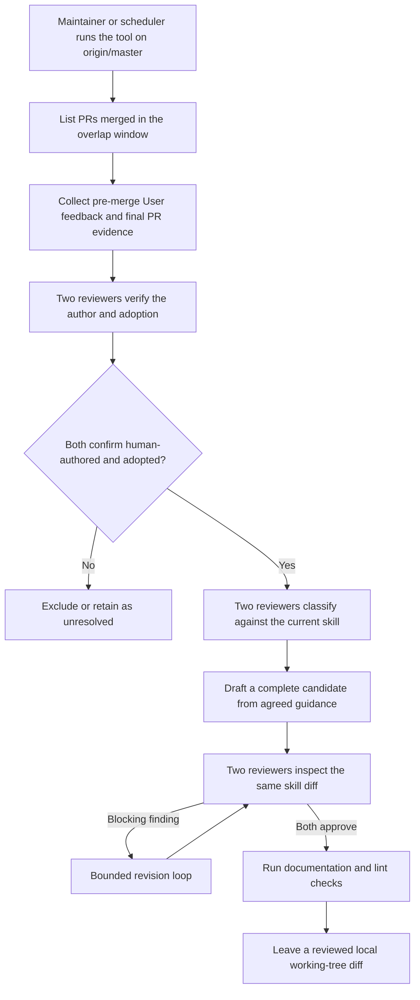

# Agent Note: dsh-code-review 的定期人工評審維護

Status: proposed

[English](2026-07-13-human-review-skill-maintenance.md) | [简体中文](2026-07-13-human-review-skill-maintenance.zh.md) | 繁體中文

## 問題

`dsh-code-review` skill（技能）記錄需要評審人判斷的失敗模式，但一次性審計重複開展起來成本高昂，作用域也容易不一致。把每條評論都當作教訓會讓檢查清單不斷膨脹；把合併、討論串已解決或作者回覆「已修復」視為採納證據，則會把最終程式碼可能並未落實的回饋提升為規則。維護流程需要足夠的證據和獨立評審，以便在證據不足時按不採納處理，同時無需在工作流程證明有用之前引入 webhook 服務、持久事件狀態或自動倉庫推廣。

## 提案

在倉庫外定期維護。一項保存在 skill 維護者機器上、而不提交到本倉庫的私有工具，會針對刷新至 `origin/master` 的乾淨完整歷史 checkout 執行。預期的調度器每天執行，並使用兩天的 UTC 重疊視窗；手動執行可以透過另一個 `--since` 時長或重複的 `--pr` 參數指定顯式集合。掃描相對於當前 skill 是冪等的，不儲存倉庫遊標。推廣時唯一會變更的倉庫文件是 [.agents/skills/dsh-code-review/SKILL.md](../../../skills/dsh-code-review/SKILL.md)；draft PR（Pull Request）列出源回饋 URL 或 ID 和採納證據，不會公開私有配接器日誌。

### 採集約定

每個選定的 PR 都會在取得任何回饋前接受過濾：其 merge commit 必須是 `origin/master` 的祖先。merge commit 可達性是唯一的資格檢查：直接 base 為功能分支的堆疊 PR，只要該 base 隨後已經進入 master，就會被納入，因為無論中間 stack 如何，評審人評論的程式碼此時已經在 master 上。工具還會解析落地 merge 的目標父級；無法重建的落地形態會記錄到 `skipped-pulls.json` 並跳過。單個 PR 在預檢、採集或證據收集時失敗，只會被跳過，不會中止整次執行。如果時間視窗會超過 GitHub 搜尋的 1,000 條結果上限，搜尋階段會明確失敗，避免無提示地遺漏已合併 PR。採集階段會完整讀取內聯評審評論、評審提交和 PR commit 的分頁連線。不採集 PR 對話評論，因為強制推送後，GitHub 當前狀態無法證明哪個仍然存在的 commit 位於評論之前，採納約定因此必然會無條件排除這些評論。只有當 GitHub 報告 actor `type` 為 `User`，並且建立時間與最後編輯時間都嚴格早於 PR 合併時，工作流程才接受已採集回饋；與合併同一時間戳的編輯視為合併後操作。評審提交使用 GraphQL 的 `lastEditedAt`，因為 REST 表示不含編輯時間。

### 採納證據

每條回饋都攜帶穩定的來源 ID 和有界的變更證據。評審人的 `commit_id` 仍屬於該 PR 時（強制推送場景無法確認即排除），工具會選擇 committer 時間戳嚴格早於回饋的最新 PR commit 作為基線，而不是採用評審人點擊的 commit，因為後者可能更舊。工具絕不會直接比較該基線與落地 merge：這種 diff 會混入不斷前移的目標分支中的無關變更。相反，它會向採納評審人提供兩份 PR 專用 patch 快照。令 `B` 為回饋基線，`T` 為落地 merge 的目標父級，`M` 為落地 merge。回饋時快照是從 `merge-base(B, T)` 至 `B` 的樹 diff；最終快照是從 `T` 至 `M` 的樹 diff。因此，目標分支專有變更不會出現在任一 PR patch 中，而回饋後加入 PR 的變更只會出現在最終快照中。關聯 commit 已因強制推送而不再屬於該 PR 的評審、早於全部現存 PR commit 的回饋，以及無法重建目標父級的落地形態，會在任何評審人看到之前確定性地歸類為 `unclear`。合併狀態、已解決討論串、作者回覆「已修復」或同文件編輯只是上下文，不是採納證明；PR 作者自己的評論絕不會進入配接器，因為它們不可能構成對作者自身意見的採納。

### 雙評審人分類與起草

兩個獨立設定的評審配接器，會對每個符合條件的條目分類：誰編寫了它（`human-authored`、`forwarded-automation` 或 `unclear`），以及變更是否採納了它（`adopted`、`rejected` 或 `unclear`）。只有兩個配接器都判定為 `human-authored` 加 `adopted` 的條目才會繼續。採納集合隨後會針對當前 skill 接受第二次獨立分類：候選項、已經覆蓋、特定於實作或並非回饋。單個條目即可符合要求，不要求重複出現。意見分歧會得到一次有界的重新評估；如果仍未解決，則繼續保留在執行產物中。單個批次的配接器輸出如果未透過 schema 或 id 校驗，系統會在批次層按不採納處理：其中的每條回饋都標記為 unclear 並路由到 `excluded`，而不是中止整次執行；有問題的原始輸出會保存在該次執行的私有產物中，供除錯使用。如果任一配接器在某項操作的任何非空批次中都沒有返回有效結果，執行會以非零狀態退出並行出失敗記錄，而不會報告「沒有候選項」。

主配接器只根據結構化的共同指引起草，絕不接收原始評審文字。根據配接器作者的約定，它保持無工具且只讀：返回完整的候選文件內容，由工具校驗後寫入唯一目標。兩個配接器隨後評審同一份完整 skill diff；阻塞性問題會進入有界修訂迴圈，而且兩者必須批准同一版修訂。工具會在執行文件和 lint 檢查前，以及報告成功前，再次拒絕暫存改動和目標 skill 之外的編輯，因此檢查或並行行程無法透過新增其他路徑混入。失敗時，工具使用盡力而為的比較並交換回滾自身寫入，以免覆蓋維護者的並行編輯。成功時，它保存一份候選資料包，其中包含源 `origin/master` commit、源 skill blob ID、已評審 diff、完整候選文件、源回饋 ID 與 URL、落地證據範圍、配接器判定和檢查結果；它絕不提交、推送、打開或合併 PR。

### 評審配接器協議

每個私有可執行文件從 stdin 接收有位元組上限、帶版本的 JSON 請求，並在 stdout 返回有位元組上限且符合 schema 的 JSON。兩個評審命令解析為逐位元組相同的可執行文件時，工具拒絕執行；這只是最低限度的機械檢查；確保主配接器與次配接器由獨立提供方或模型驅動程式，仍是部署運維方的責任。`access` 與 `tools` 欄位是配接器作者承擔的約定標記，不是 OS 沙盒：評審子行程在清理後的環境中 spawn，其 `cwd` 指向私有執行目錄而非倉庫根目錄；回饋包裝在帶隨機數的 `<untrusted-feedback nonce="…">` 塊中，每個提示詞都會要求模型把它視為資料；128 位隨機數防止不受信任的正文偽造結束標籤。每個子行程都採用有界、感知中止的行程樹清理。配接器作者把每項操作實作為純只讀推理（inference）；即使 `edit` 操作也只會在 JSON 中返回完整候選內容，由工具校驗後寫入唯一目標。每個生產 `git`／`gh`／檢查命令同樣在清理後的環境中 spawn，避免 pre-push 掛鉤的路由變數無提示地重定向維護工具。候選寫入與失敗回滾會針對最近一次寫入內容使用盡力而為的比較並交換；回滾還會取消暫存目標，避免由配接器或檢查暫存的候選項在失敗執行後遺留並進入之後的 commit。

### 推廣約定

推廣輔助工具從刷新至 `origin/master` 的乾淨 checkout 開始；當前 skill blob 與資料包中記錄的源 blob 不同時，它拒絕應用候選項。運維方隨後重新執行維護分析，或手動把 diff 變基後重新評審候選項；輔助工具絕不會用過時的完整文件輸出替換較新的 `SKILL.md`。應用仍然有效的候選項後，它會打開 draft PR，其正文列出源回饋 URL 或 ID、用作採納證據的落地 commit 範圍、發起該候選項的執行、檢查結果和任何運維方編輯。原始配接器提示詞與回應保持私有，但倉庫評審人會獲得這些具體輸入，從而判斷每條提議規則是否確實來自已採納的人類回饋。

### 機制所在位置

工具原始碼、配接器二進位檔案、提供方憑據和預期的每日調度器保存在維護者機器上，不會提交到本倉庫。本文規定協議，參考實作屬於私有基礎設施。該機制只服務於由單個運維方維護的一項 skill，因此，持續透過倉庫評審審查機制改動的成本高於提交工具及其歷史的收益。如果該機制將來移交給第二位維護者，移交工作需要一篇後續 Agent Note 來修訂本決策；任何接手者都應從運維文件 [docs/cookbook/maintaining-dsh-code-review.md](../../../../docs/cookbook/maintaining-dsh-code-review.md) 入手。

## 考慮過的替代方案

- **把工具放入本倉庫。** 對單維護者作用域不予採納：倉庫維護開銷（型別檢查、lint、覆蓋率與橫切重構）會超過已提交原始碼和評審歷史的價值。未來移交時仍可重新考慮。
- **記錄每條回饋產生時的 PR head**：不予採納，因為這需要持續執行的觀察器、持久事件狀態、重試和強制推送協調。定期維護會在可用時使用經過評審的 commit 證據，並在整 PR 證據範圍過寬、無法確認時直接排除。
- **持久化已處理 PR 遊標**：不予採納，因為帶重疊的時間視窗掃描成本低廉，並且相對於當前 skill 天然冪等；遊標狀態反而帶來復原和漏事件問題。
- **每次新評論都執行**：不予採納，因為一輪評審會產生許多相關評論，並且缺少判斷採納情況所需的最終產物。
- **把合併或討論串解決視為採納**：不予採納，因為 PR 可能在回饋被拒絕、被取代或刻意不解決的情況下合併。
- **自動建立或合併倉庫改動**：不予採納，因為工具首先需要透過有用的定期輸出積累可信記錄。維護者檢查並透過普通倉庫評審推廣本機 diff。
- **從已經修復的 bot 問題中學習**：不予採納，因為來源約定限定為人類評審回饋。系統會在分析前按作者類型過濾，並透過作者檢查排除轉發自動化問題的人類帳號。
- **讓同一個評審人既當作者又作最終裁決**：不予採納，因為獨立判定能在不受支持的概括進入 skill 之前暴露問題。

## 驗收標準

從 `proposed/` 推廣到 `implemented/`，需要在針對本倉庫的真實端到端執行中觀察到以下全部事實：

- 私有工具從刷新至 `origin/master` 的乾淨 detached checkout 執行，並且要麼報告「沒有候選項」，要麼只生成 `.agents/skills/dsh-code-review/SKILL.md` 的 working-tree diff。**2026-07-15 已觀察：** 掃描 62 個已合併 PR，跳過 5 個（merge commit 不可達或採集超過 250 個 commit 的上限），考慮 426 條人類回饋，發現 0 個候選項。
- 兩個評審配接器獨立設定（不同的提供方或模型），無需使用者幹預即可完成 analyze／adopt／review 流程。**2026-07-15 已觀察：** 不同的主／次配接器約用 8 分鐘完成採納與分析；一次配接器 id 幻覺由批次級保守失敗機制處理，沒有中止整次執行。
- 調度器在沒有互動式終端機的情況下觸發工具，並透過持久通知通道把候選 diff（或「沒有候選項」記錄）送達運維方。
- 一個受控採集場景會在回饋基線之後，向目標分支加入與回饋匹配的變更；評審證據排除該目標分支專有變更，同時保留後續由 PR 自身加入的變更。
- 源 skill 改變後，推廣輔助工具會拒絕候選項；仍然有效的候選項會打開 draft PR，其中包含上文定義的源回饋 ID、已採納 commit 範圍、發起該候選項的執行、檢查和運維方編輯。
- 該工作流程生成的至少一個候選 diff 會由運維方檢查，並透過普通倉庫 PR 評審推廣到 `master`。該 PR 用以證明工作流程能夠把已採納回饋轉化為已交付的 skill 指引。

## 風險

- **根據 committer 時間戳推斷因果關係。** 回饋 commit 基線透過比較 GitHub commit 時間戳與回饋建立時間戳選出；committer 時鐘偏差與重寫仍會留下誤判採納的殘餘視窗。與 GitHub 的 PR 事件串流交叉比對可以進一步收緊，但需要採集定期工具作用域以外的事件。
- **兩個「非候選項」分類結果會直接路由到 `excluded`，不進入爭議輪次。** 兩個分類器都判斷「不是候選項」，但對非候選原因意見不一時（例如 `covered` 與 `specific`），該條目會被排除而不是重新評估。兩個分類器都同意它不會形成新的評審行為，所以爭議輪次不會改變結果。
- **超出位元組雜湊差異的雙評審人獨立性屬於部署約定。** 兩個命令解析為逐位元組相同的可執行文件時，工具拒絕執行，但它無法驗證兩個不同包裝層是否由不同提供方或模型驅動程式。運維方必須設定相互獨立的主配接器與次配接器。
- **候選寫入與回滾使用盡力而為的比較並交換。** POSIX 上基於文件的比較並交換並不真正原子；視窗持續一個事件迴圈週期。該工具面向單使用者定期維護，不考慮真正並行的編輯器。
- **單維護者風險。** 由於機制位於單臺機器，服務中斷後，skill 維護會完全停止，直到運維方復原服務，或透過一篇後續 Agent Note 把機制移交給新維護者。
