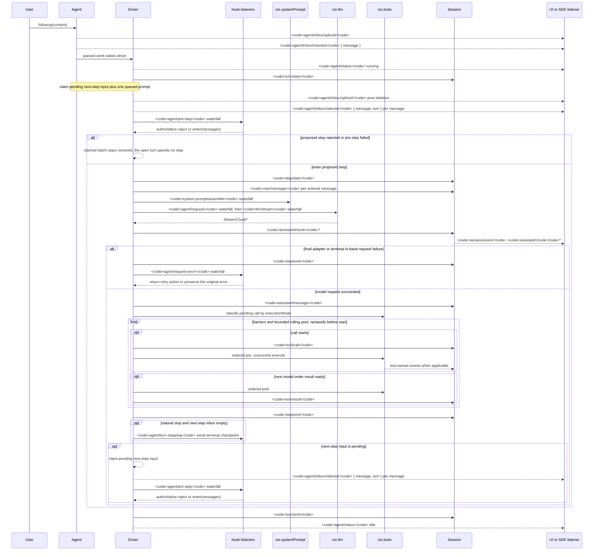

<!-- 英文原始檔由 scripts/gen-doc-graphs.ts 生成；本中文文件是透過雙語配對維護的經評審對側。
     更新時先執行 `pnpm run gen-doc-graphs` 更新英文，再更新本文件並執行 `pnpm run verify-translation-pairing --write docs/agent-lifecycle.md` 重新記錄配對。 -->

# Agent 輪次與步驟生命週期

[English](agent-lifecycle.md) | 繁體中文

此時序圖是 [architecture.md](architecture.md#turn-flow) 的配套圖示。持久的重播事實保存在 `session/event` 中，即時控制與狀態則保存在 `agent/*` 中。

`assistant/message` 事件會記錄每次成功的提供方呼叫，包括返回空內容或以 `max-tokens` 結束的呼叫。空內容不會進入派生歷史，但該持久事件仍會保留用量，並透過 `sourceEventSeqs` 精確列出對應的 `assistant/chunk` 事件，包括顯式空清單。

`dsh-compaction-basic` 在派生請求之前透過 `agent/pre-step` 處理壓力，而 `agent/request-error` 僅用於規範的上下文溢位。任一觸發條件滿足後，系統都會先執行選填的工具結果剪枝，再選擇摘要。復原發生在失敗步驟結束之後、失敗輪次結束之前；只有當剪枝或摘要生成推進了 surface replacement generation 時，系統才會開啟一個全新的重試輪次，否則仍以原始請求錯誤為準。

以返回的 `agent/pre-step` 決策為準；透過包裝 `next()` 的監聽器會保留下游訊息，除非有意替換這些訊息。steering（中途引導）和注入的上下文在後續的認領操作取得其下一步驟批次後，會經過同一 waterfall（瀑布式事件）。

需要可重播 transcript（文字記錄）資料的 SDK 使用者應當消費 `session/event`；`agent/*` 是用於佇列與狀態、提示詞攔截、請求構造、steering、繼續執行和錯誤處理的即時協調介面。

維護模式：英文原始檔包含人工維護的 Mermaid 時序圖，並由生成器寫出；本中文文件作為經評審對側透過雙語配對維護。確切的事件簽名位於生成的 Cordis 目錄中。
